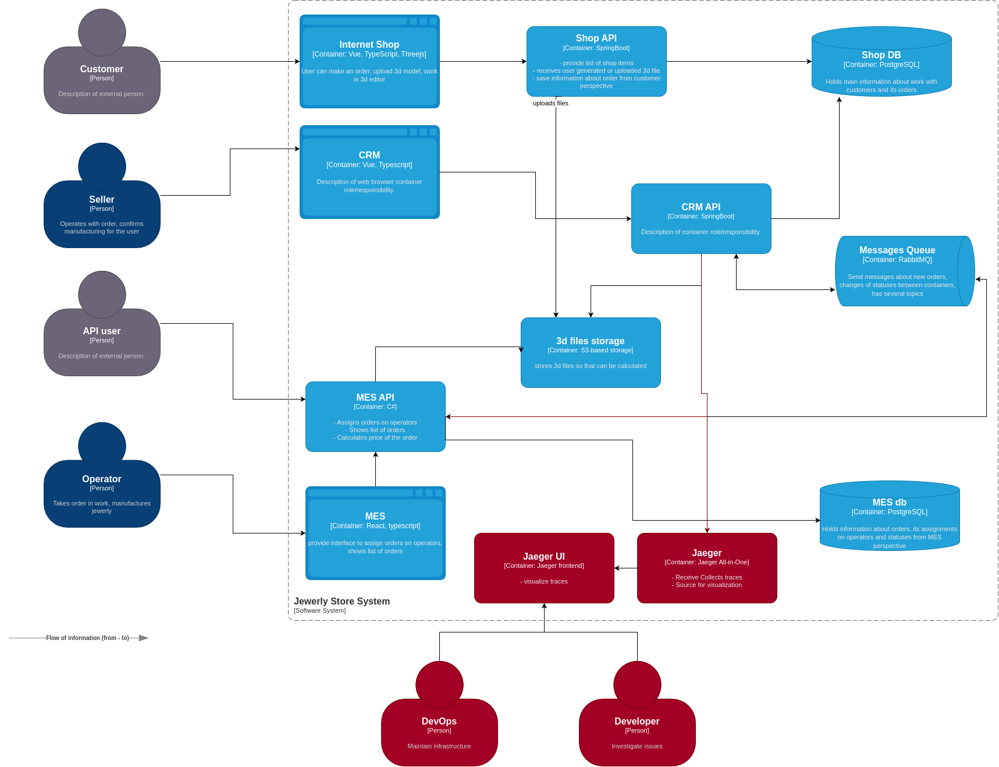

### Задание 3. Трейсинг

#### Проанализируйте систему компании и C4-диаграммы в контексте планирования трейсинга.

##### Идентификация мест, где заказ может сломаться и зависнуть

Прежде всего, проблемными выглядят места, которые непосредственно взаимодействуют с MES API, а именно CRM API и сам MES API, с передачей span-информации через сообщения очередей и топики.

#### Мотивация

Это даст компании возможность увеличить прибыль за счет уменьшения издержек на поиск проблем в данной архитектуре, позволит принимать решения о ее развитии, основываясь на фактах.

#### Технические и бизнес-метрики решения, на которые повлияет внедрение трейсинга

- **Среднее время восстановления после сбоя (MTTR — Mean Time to Recovery)**:
  Среднее время, необходимое для восстановления системы после инцидента. Внедрение трейсинга сократит MTTR благодаря быстрой диагностике причин проблем.
  
- **Затраты на обслуживание (Maintenance Costs)**:
  Более стабильная и предсказуемая работа системы снизит расходы на экстренную поддержку и непредвиденное техническое обслуживание.

- **Коэффициент доступности (Uptime)**:
  Процент времени, когда система доступна для использования пользователями. Повышенная надежность и быстрое восстановление после сбоев увеличат этот показатель.

#### Предлагаемое решение

Предлагается добавить Jaeger, а также Jaeger UI для возможности мониторинга системы для DevOps и разработчиков.

#### Компромиссы

На начальном этапе предполагается более простой вариант с Jaeger All-in-one, который впоследствии, при необходимости, можно будет доработать до более сложной инфраструктуры. Однако, исходя из текущей нагрузки системы, это может быть настроено позже.

#### Аспекты безопасности

Поскольку будет храниться чувствительная информация, предполагается, что доступ будет предоставлен только для DevOps и разработчиков, имеющих определенные роли, через OAuth-аутентификацию.

#### Дополнительное задание
не реализованно