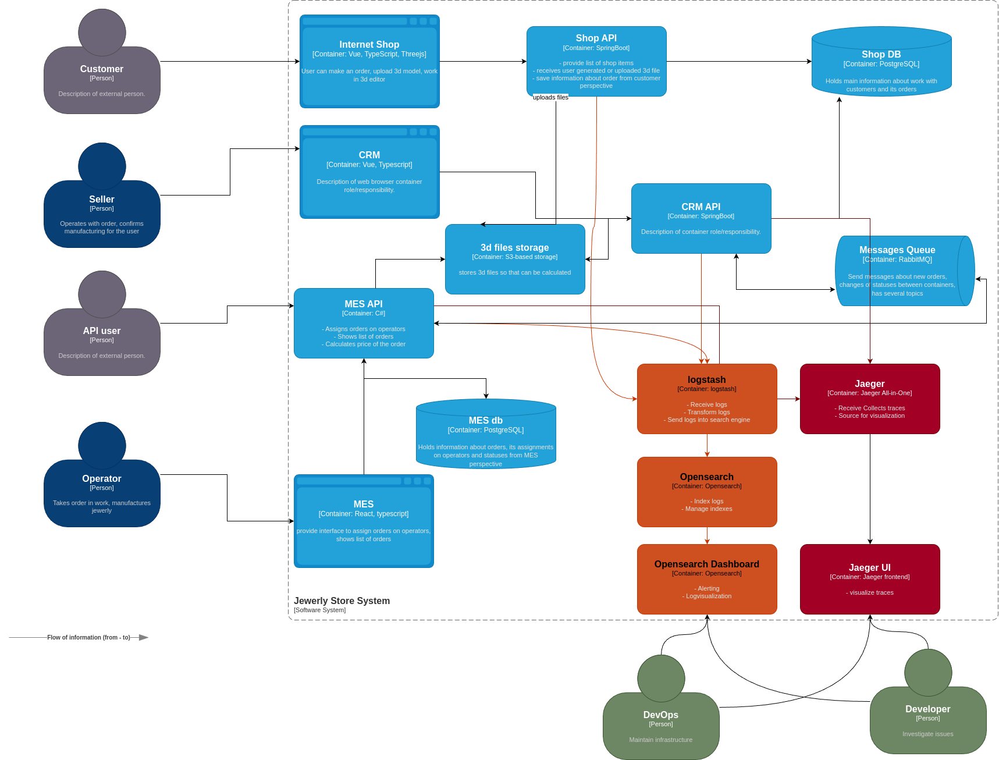

# Задание 4. Логирование

## Какие логи нужно собирать в приложении

Необходимо собирать логи из систем Shop API, MES API, CRM API, в последствии также из серверов выдающих статику Internet Shop и MES, CRM 

общие данные для всех логов, это 
- дата время
- идентифцикатор трассировки (для провязывания трассировки и логгирования), то что будет уходить через opentelemetry

о движении заказа по статусам,
для этого логи должны включать в себя 
- индентификатор заказа
- индентификатор покупателя
- источник заказа, онлайн магазин или B2C
- данные об операторе который выполняет заказ
- систему/компонент выполняющий логгирование (для последующей централизованной обработкаи в ELK)

логгирование процесса загрузки файлов моделей
- включать данные о заказе
- размер модели
- источник модели (конструктор или произвольная загрузка)

логгирование процесса расчета
- включать данные о заказе
- информацию об исходной моделе, размер, источник (конструктор или произвольная модель)
- начало расчета
- окончание расчета

ERROR/FATAL - каждый из сервисов должен также предоставлять все те же данные в случае ошибок с уровнем 
INFO - в случае normal flow

## Мотивация

Основная причина внедрения метрик это повышение уровня наблюдаемости и сопровождаемости системы, засчет более быстрого и более детального анализа инцендентов а также более быстрого реагирования на них через алерты

метрики сдесь схожи с трейсингом

- **Среднее время восстановления после сбоя (MTTR — Mean Time to Recovery)** 
- **Затраты на обслуживание (Maintenance Costs)**
- **Коэффициент доступности (Uptime)**

в первую очередь имеет смысл покрывать логами MES API по тому как это выглядит как наиболее проблемный компонент системы, далее CRM API и SHOP API , для более полного отслеживания потенциальный проблем в ходе движения заказа по статусам

## Предлагаемое решение

### технологии

Предлагается использовать Filebeats который будет посылать данные в Logstash, после чего логи будут преобразовываться и отправляться в Opensearch индектироваться, и служить источником данных для Opensearch Dashboard

### безопасность

Авторизация предполгается для пользователей через OpenId протокол.

### Политика хранения индекса

Hot фаза: Индексы находятся в активной фазе, когда активно поступают новые данные. При достижении максимального размера (25 ГБ) или количества документов (5 млн) происходит создание нового индекса.

Warm фаза: Через 2 недели индексы переходят в тёплую фазу, где выполняется оптимизация данных (сжатие сегментов и уменьшение числа шард).

Cold фаза: Ещё через 4 неделю индексы становятся доступными только для чтения.

Delete фаза: По прошествии 60 дней старые индексы удаляются.

## мероприятия для превращения системы сбора логов в систему анализа логов

Есть необходимость ли настроить какой-то алертинг, для отслеживания подвисших заказов, т.к. это в данный момент проблема бизнеса, также нужно установить алерты при выходе ошибок из нормы

Также резкого увелечения дельты входящих запросов на создание заказов, и особенно на загрузку файлов моделей украшений т.к. они могут нагрузить систему и забить очередь

## Критерии для выбора технологии

не решено