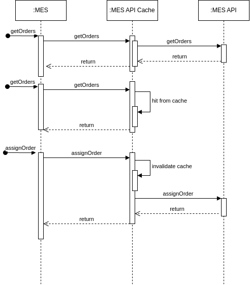

# Задание 5. Кеширование

## Мотивация
Мотивация была кратко описана в Exc1. Ниже будет более развернуто.

В данный момент есть проблема с тем, что:
1. операторы сталкиваются с проблемой загрузки списка заказов
1. также с тем, что система долго рассчитывает стоимость заказов на основе модели.

Кэшировать расчет стоимости не представляется рациональным, так как по описанию задачи ключевая особенность — это изготовление на заказ из произвольных моделей.

Но есть возможность кэшировать данные для операторов. Эта область дает широкий спектр возможностей поднять производительность — от простых (клиентское кэширование) до сложных решений (гибридный серверный кэш), которые позволят улучшить UX.

Прежде всего стоит включить в кэширование MES и MES API.

## Предлагаемое решение

Как и было описано в Exс1 в планировании и описании проблем, предлагаются два решения, которые могут внедряться как последовательно, так и параллельно, а также по отдельности.

1. **Ревизия и внедрение кэширования на стороне MES UI-клиентов**, 
чтобы минимизировать проблему с минимальными усилиями в кратчайшие сроки.
Этот компромисс означает небольшой процент отказов при создании нового заказа, если другой оператор уже начал работать с ним, однако он «разблокирует» общую работу.

1. **Создание отдельного ACL-сервиса(Cache Aside) для кэширования** 
(внутри реализующего Read-Through + Write-Through), работающего как обратный прокси-сервер, который будет кэшировать заказы для операторов и обновлять кэш при изменении статуса заказа оператором.
Это сведёт к минимуму ситуацию, когда два оператора одновременно начинают работу с одним заказом.

Refresh-Ahead не очень подходит по причине создания постоянной нагрузки на и без того нагруженный сервис MES API, не давая существенных преимуществ перед кешированием на стороне клиента.

Причина, по которой предлагаются именно такие решения, а не более сложные, — текущие проблемы с долгими релизами и низкой продуктивностью разработки.
Как вариант более сложной реализации мог быть бы обновление на основе очереди сообщений и топиков, но это потребует правок в других сервисах.

| Инвалидация, основанная на запросах | Программная инвалидация | Инвалидация на основе изменений | Инвалидация по ключу | Временная инвалидация |
|---|---|---|---|---|
| Данная стратегия выглядит наиболее оптимальной, т.к. есть четкий запрос, который будет приводить к обновлению кэшированных данных, и при этом может быть реализована относительно просто | В силу проблемных релизов не оптимальна, т.к. будет требовать более сложной реализации | Также как и программная валидация, будет требовать более сложной реализации | Инвалидация по ключу не совсем подходит для проблемного сценария, когда нужно получать список заказов, хотя в целом технически возможна, но может привести к сильной рассинхронизации данных, т.к. заказы могут меняться также и из внешних систем | Может быть применена, т.к. данные могут изменяться не только от действий непосредственно с MES, например, статус заказа изменится через CRM |

## Дополнительное задание. 

не предоставленно.